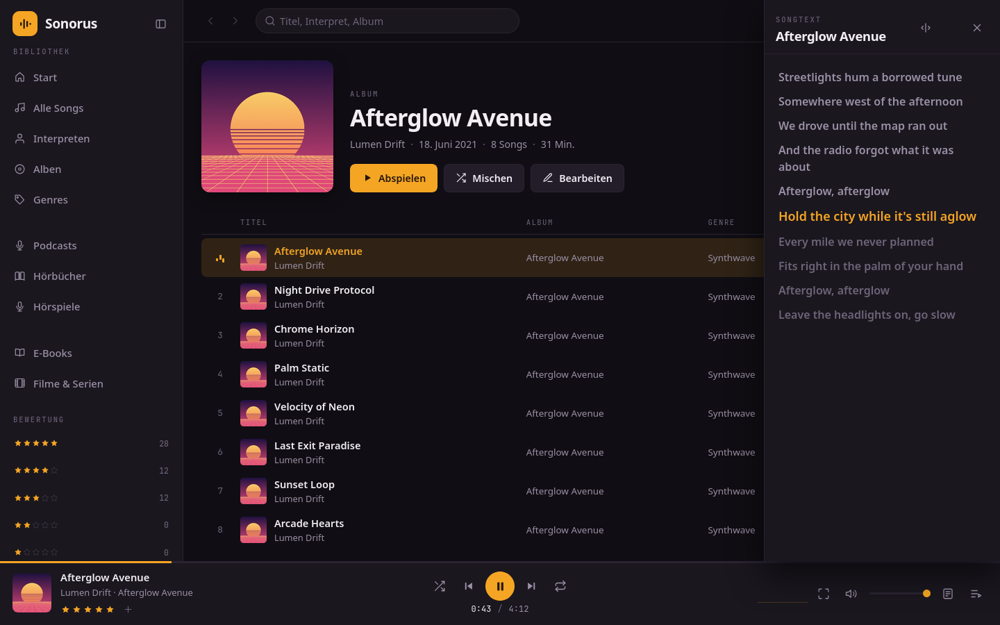
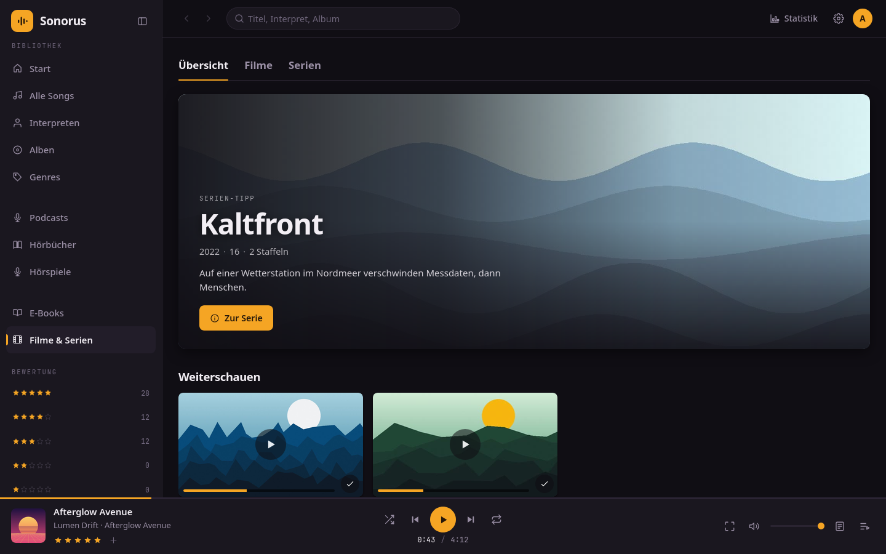
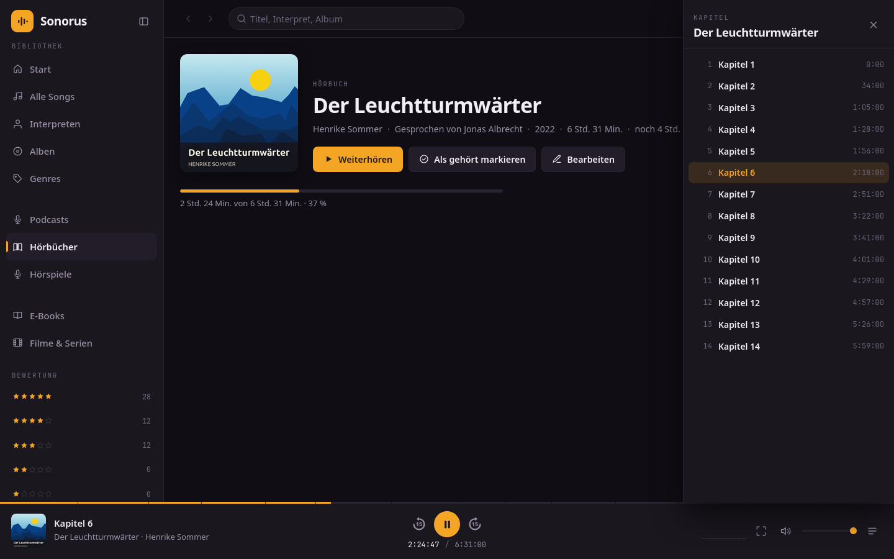

# Sonorus

Selbst gehosteter Mediaplayer für die eigene Sammlung: Musik, Podcasts,
Hörbücher, Hörspiele, E-Books, Filme und Serien. Läuft im Browser, als
[Android-App](https://github.com/flopsyan/sonorus-android), als
[Linux-Client](https://github.com/flopsyan/sonorus-linux) und für Filme und
Serien als [Android-TV-App](https://github.com/flopsyan/sonorus-androidtv).



## Funktionen

- **Musik**, geordnet nach der Ordnerstruktur statt nach Tags: Interpreten,
  Alben, Singles, Sampler und Genres.
- **Bewertungen** von 1 bis 5 Sternen für Songs und Alben, mit automatischen
  Playlists je Bewertung.
- **Playlists** mit Ordnern, dazu Import aus CSV-Exporten von Streamingdiensten.
- **Songtexte** aus den Dateien oder einer `.lrc` daneben, zeilengenau
  mitlaufend, wenn sie Zeitmarken tragen.
- **Podcasts, Hörbücher und Hörspiele** in eigenen Bibliotheken, mit gemerkter
  Position und Kapiteln.
- **E-Books** (EPUB) mit einer Leseansicht im Browser und in der App.
- **Filme und Serien** im Ordneraufbau von Jellyfin, mit Weiterschauen und
  optional Beschreibungen, Besetzung und Bildern von TMDB. Was der Browser nicht
  abspielen kann, wandelt der Server beim Abspielen um.
- **Mehrere Konten**: Die Bibliothek teilen sich alle, Playlists, Bewertungen
  und Verlauf gehören je einem Konto.
- **Statistik** über die gehörte und gesehene Zeit.
- **Kleinere Qualität** (Opus 128 kbps) für verlustfreie Dateien, pro Gerät
  wählbar.
- Die Medienordner werden **nur gelesen**, nie verändert.

<p>
  
  
</p>

## Installation

Voraussetzung ist Docker mit Compose.

```bash
git clone https://github.com/flopsyan/sonorus.git
cd sonorus
cp .env.example .env      # Pfade zu den Medienordnern eintragen
docker compose up -d --build
```

Dann http://localhost:3000 öffnen und das erste Administratorkonto anlegen. Der
erste Scan startet von selbst, weitere lassen sich unter **Einstellungen**
auslösen.

Aktualisieren: `git pull && docker compose up -d --build`

## Konfiguration

Alle Einstellungen stehen in der `.env`, die Vorlage ist `.env.example`.

| Variable | Standard | Bedeutung |
| --- | --- | --- |
| `MUSIC_DIR` | `./music` | Musikordner |
| `PODCAST_DIR` | `./podcasts` | Podcasts |
| `AUDIOBOOK_DIR` | `./audiobooks` | Hörbücher |
| `AUDIODRAMA_DIR` | `./audiodramas` | Hörspiele |
| `EBOOK_DIR` | `./ebooks` | E-Books |
| `VIDEO_DIR` | `./videos` | Filme und Serien |
| `TMDB_API_KEY` | leer | Schlüssel von themoviedb.org für Infos und Bilder zu Filmen und Serien |
| `VIDEO_HWACCEL` | leer | `vaapi` wandelt Filme auf der Grafikkarte um statt auf der CPU |
| `TZ` | `Europe/Berlin` | Zeitzone, nach der die Statistik zählt |
| `PORT` | `3000` | Port auf dem Host |
| `SITE_NAME` | `Sonorus` | Name in Kopfzeile und Browser-Tab |
| `AUTH_USER`, `AUTH_PASSWORD` | `admin`, leer | Legt das erste Administratorkonto ohne Einrichtungsseite an |
| `AUTH_SECRET` | zufällig | Schlüssel für die Sitzungs-Cookies |
| `TRUST_PROXY` | `1` | Anzahl der Reverse Proxies davor, `false` ohne Proxy |
| `SCAN_ON_START` | `auto` | Scan beim Start: `auto` (nur bei leerer Bibliothek), `always` oder `never` |
| `TRANSCODE_MAX_GB` | `60` | Obergrenze für die Kopien in kleinerer Qualität, `0` für unbegrenzt |

Die Medienordner werden nur lesend eingehängt, dürfen fehlen und dürfen nicht
innerhalb von `MUSIC_DIR` liegen. TMDB ist die einzige Verbindung ins Internet.
Für `VIDEO_HWACCEL` muss die Grafikkarte in den Container: `devices` und
`group_add` in der `docker-compose.yml` einkommentieren.

## Ordneraufbau

Interpret, Album und Titelnummer kommen aus den Ordner- und Dateinamen, nicht
aus den Tags. Cover, Genre, Datum und Songtext werden aus den Dateien gelesen,
ein Songtext auch aus einer `.lrc` mit gleichem Namen.

```
music/
  Interpret/
    Album/
      01 - Titel.flac
      01 - Titel.lrc            Songtext, optional
    Titel.flac                  lose im Interpretenordner: Single
  Various/
    Sampler/
      01 - Interpret - Titel.flac
    Interpret - Titel.flac      Single
podcasts/
  Sendung/
    #001 Folge.mp3
audiobooks/                     audiodramas/ und ebooks/ genauso
  Autor/
    Buch/
      01 - Teil 1.mp3
videos/
  movies/
    Film (1999)/
      Film (1999).mkv
  shows/
    Serie (2008)/
      Season 01/
        S01E01 Pilot.mkv
```

Bilder (`folder.jpg`, `backdrop.jpg`, `logo.png`) und Untertitel
(`Film (1999).de.srt`) neben Filmen und Serien werden übernommen, genau wie
Jellyfin und Kodi sie ablegen.

## Ohne Docker

```bash
npm install
MUSIC_DIR=/pfad/zur/musik npm start
```

Braucht Node.js 20 oder neuer. Für Filme und Serien, Kapitel und die kleinere
Qualität zusätzlich `ffmpeg` und `ffprobe` im `PATH`. Die Daten landen in
`./data` (`DATA_DIR`).

## Sichern

Konten, Playlists, Bewertungen und Verlauf liegen im Volume `sonorus-data`, nur
das muss ins Backup. Die Bibliothek baut ein Scan jederzeit neu auf, die Kopien
in `sonorus-transcodes` lassen sich neu erzeugen.
